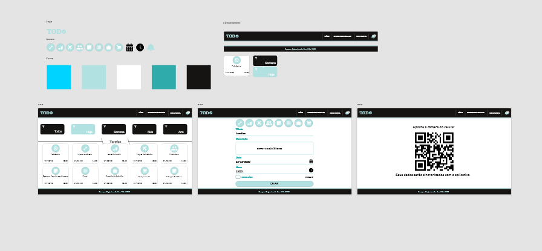

# <h2>todo-planner</h2>
Todo-Planner Projeto sendo feito dentro de um curso da plataforma UDEMY. Contempla a prototipação, front-end em react, back-end em node, banco com mongo db e versão mobile de um aplicativo de organização de tarefas.

